```mermaid
graph TD
    A["App Router"]
    
    A -->|public| B["Landing Page /<br/>LandingPage"]
    A -->|public| C["Login /login<br/>AuthPage"]
    A -->|public| D["Sign Up /signup<br/>AuthPage"]
    
    A -->|protected| E["Dashboard /app/*<br/>DashboardPage + Outlet"]
    
    E --> E1["Dashboard Index /app<br/>PlaceholderView"]
    E --> E2["SEO /app/seo<br/>SEOPage"]
    E --> E3["SEO Site Details /app/seo/site/:id<br/>SEOSiteDetails"]
    E --> E4["ASO /app/aso<br/>ASOPage"]
    E --> E5["Marketplace /app/marketplace<br/>MarketplacePage"]
    E --> E6["Analytics /app/analytics<br/>AnalyticsPage"]
    E --> E7["Social /app/social<br/>SocialPage"]
    E --> E8["Email /app/email<br/>EmailPage"]
    E --> E9["Profile /app/profile<br/>PlaceholderView"]
    E --> E10["Account /app/account<br/>TenantIntegrationsPage"]
    
    E2 -->|Manage Site| E3
    E3 -->|Back| E2
    
    style A fill:#4c7cfa
    style B fill:#2f3e4e
    style C fill:#2f3e4e
    style D fill:#2f3e4e
    style E fill:#1e3a8a
    style E1 fill:#1e40af
    style E2 fill:#1e40af
    style E3 fill:#1e40af
    style E4 fill:#1e40af
    style E5 fill:#1e40af
    style E6 fill:#1e40af
    style E7 fill:#1e40af
    style E8 fill:#1e40af
    style E9 fill:#1e40af
    style E10 fill:#1e40af
```

## Route Navigation Flow

```
                      ┌─────────────────────────────────────┐
                      │   Not Authenticated                 │
                      ├─────────────────────────────────────┤
                      │  / (Landing) ──→ /login OR /signup  │
                      └─────────────────────────────────────┘
                                   ↓
                        [User Logs In/Signs Up]
                                   ↓
                      ┌─────────────────────────────────────┐
                      │   Authenticated                      │
                      ├─────────────────────────────────────┤
                      │   /app (Dashboard)                  │
                      │   ├─ /app/seo                       │
                      │   │  └─ /app/seo/site/:id           │
                      │   ├─ /app/aso                       │
                      │   ├─ /app/marketplace               │
                      │   ├─ /app/analytics                 │
                      │   ├─ /app/social                    │
                      │   ├─ /app/email                     │
                      │   ├─ /app/profile                   │
                      │   └─ /app/account                   │
                      └─────────────────────────────────────┘
```

## Component Hierarchy

```
BrowserRouter
  └─ Routes
      ├─ Route "/" → LandingPage
      ├─ Route "/login" → AuthPage (login mode)
      ├─ Route "/signup" → AuthPage (signup mode)
      └─ Route "/app/*" → Protected (user ? DashboardPage : redirect to /login)
          └─ DashboardPage (AppNavbar + DashboardSidebar + Outlet)
              ├─ Route "" → PlaceholderView (Dashboard)
              ├─ Route "seo" → SEOPage
              │   └─ SeoOptimisationView (displays site list)
              │       └─ Manage button navigates to /app/seo/site/{id}
              ├─ Route "seo/site/:id" → SEOSiteDetails
              │   └─ useParams().id extracts site ID from route
              ├─ Route "aso" → ASOPage
              ├─ Route "marketplace" → MarketplacePage
              ├─ Route "analytics" → AnalyticsPage
              ├─ Route "social" → SocialPage
              ├─ Route "email" → EmailPage
              ├─ Route "profile" → PlaceholderView
              └─ Route "account" → TenantIntegrationsPage
```
